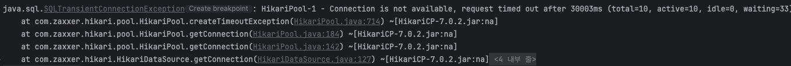
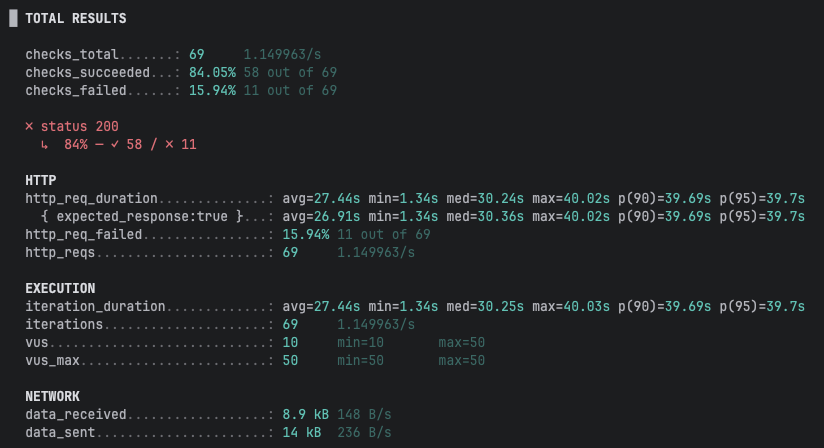
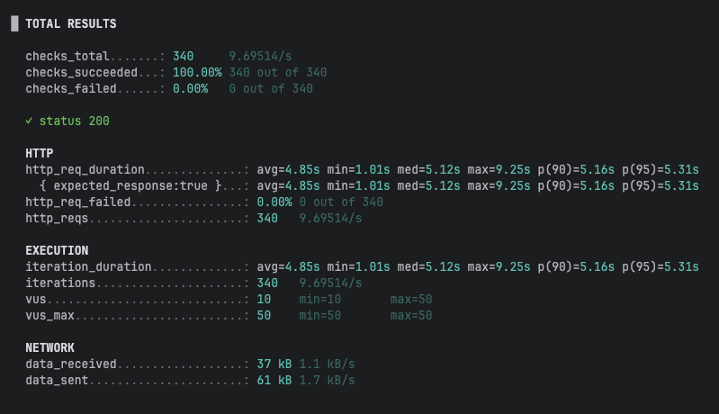
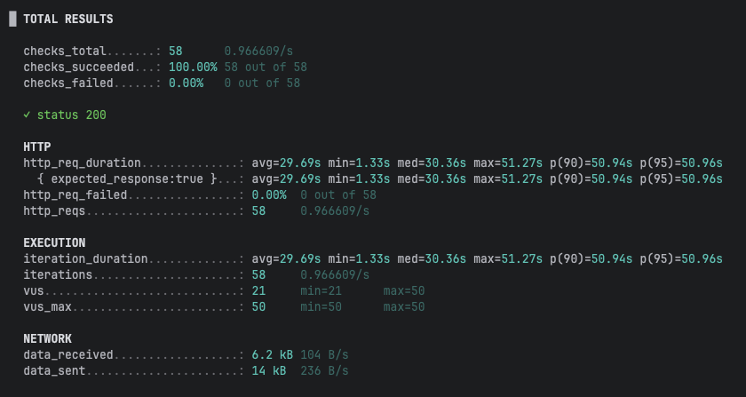
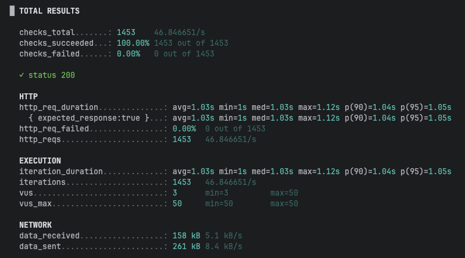
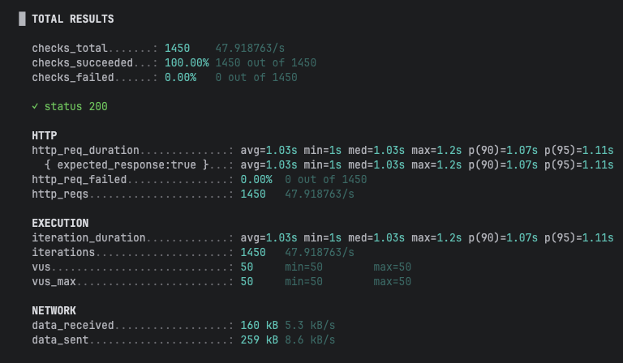
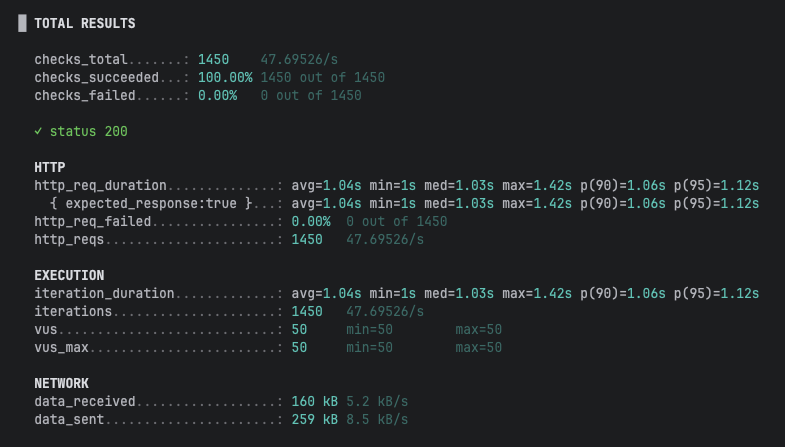
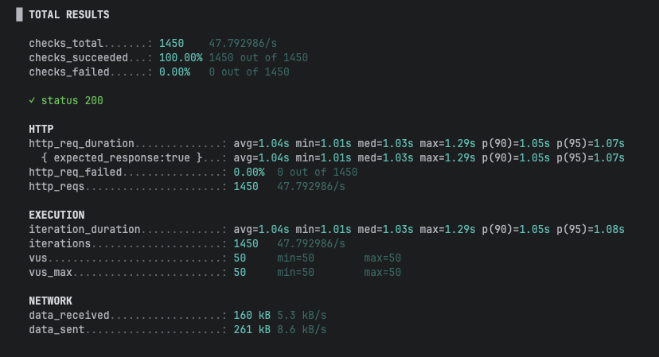
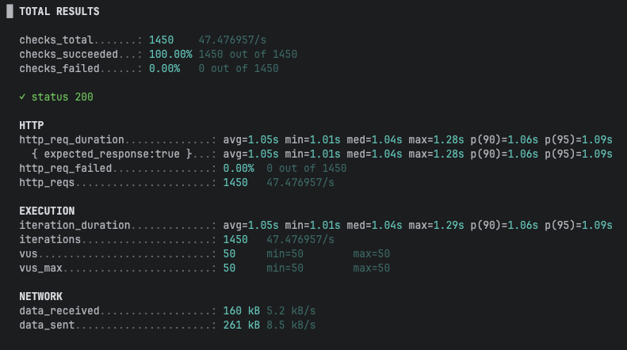

# 비관적 락 + 외부 결제 호출이 만든 처리량 병목과 트랜잭션 분리

## 문제

주문 API에 대해 k6(50 VU, 30초)로 부하 테스트를 진행했다.

결제는 외부 PG 호출이 발생하는 상황을 가정했다. 실제 PG 연동 대신 트랜잭션 내부에서 1초간 대기하도록 구현하여 결제 처리 시간을 모사했다.

50개의 요청이 동시에 처리된다고 가정하면 이론상 약 40~50 TPS 수준의 처리량을 기대할 수 있다. 그러나 실제 테스트에서는 처리량이 기대 수준에 미치지 못했고, 커넥션 타임아웃 예외가 발생했다.



*그림 1. HikariCP 커넥션 풀 고갈(total=10, active=10, idle=0, waiting=33)로 인한 타임아웃 예외.*

원인이 단순한 커넥션 풀 부족인지, 비관적 락 경합 때문인지 확인하기 위해 두 가지 시나리오로 테스트를 진행했다.

* **same** : 같은 상품에 50명이 30초간 동시 요청
* **diff** : 서로 다른 상품에 50명이 30초간 동시 요청

## 1. 커넥션 풀 기본값(10)

| 시나리오        |  TPS |            에러 |   p95 |
| ----------- | ---: | ------------: | ----: |
| same (락 경합) | 1.15 | 15.9% timeout | 39.7s |
| diff (락 없음) | 9.70 |            0% | 5.31s |



*그림 2. same(같은 상품), 커넥션 풀 10. 15.9%가 커넥션 타임아웃으로 실패.*



*그림 3. diff(다른 상품), 커넥션 풀 10. 에러는 없지만 TPS가 9.70에 머물렀다.*

same 시나리오에서는 먼저 락을 획득한 요청이 결제를 수행하는 동안 나머지 요청이 락을 기다리며 커넥션을 점유했다. 결국 커넥션 10개가 모두 사용 중인 상태가 되었고, 대기 중인 요청은 Hikari 큐(waiting=33)에서 30초를 기다리다 타임아웃으로 실패했다.

반면 diff 시나리오는 락 경합이 없는데도 TPS가 9.70에 불과했다. 결제 처리 동안 커넥션을 계속 점유하고 있었기 때문에 실제 동시 처리 수가 커넥션 풀 크기인 10으로 제한된 것이다.

## 2. 커넥션 풀 크기 증가 (10 → 50)

| 시나리오 |   TPS | 에러 |   p95 |
| ---- | ----: | -: | ----: |
| same |  0.97 | 0% | 50.9s |
| diff | 46.85 | 0% | 1.05s |



*그림 4. same, 커넥션 풀 50. 타임아웃은 사라졌지만 TPS는 0.97에 머물렀고 p95는 50.9초까지 증가했다.*



*그림 5. diff, 커넥션 풀 50. TPS가 46.85까지 증가했다.*

diff 시나리오는 TPS가 9.70에서 46.85로 약 5배 증가했다. 락 경합이 없는 환경에서는 커넥션 풀이 병목이었고, 풀 크기를 늘리자 처리량도 함께 증가했다.

반면 same 시나리오는 타임아웃은 사라졌지만 TPS가 거의 개선되지 않았다. 커넥션이 충분하더라도 동일 상품에 대한 비관적 락으로 인해 요청이 순차적으로 처리되기 때문이다.

즉, 커넥션 풀 부족은 일부 현상을 악화시키고 있었을 뿐 근본 원인은 아니었다.

실제 병목은 외부 결제 호출이 트랜잭션 내부에서 수행되면서 락을 오랫동안 점유하는 구조였다.

## 해결 - 트랜잭션 분리

문제의 원인은 재고 차감과 결제 처리가 하나의 트랜잭션 안에서 수행된다는 점이었다.

변경 전에는 재고 차감을 위해 획득한 락을 결제가 끝날 때까지 유지했다.

```kotlin
@Transactional
fun createOrder(userId: Long, orderRequest: OrderCreateRequest): Long {
    // ...

    val product = productRepository.findByIdForUpdate(item.productId)
        ?: throw EntityNotFoundException("Product not found")

    product.reduceStock(item.quantity)

    // ...

    if (paymentClient.pay(order)) { // 외부 결제 호출
        order.paid()
    } else {
        throw Exception("Payment failed")
    }

    return order.id!!
}
```

결제는 락이 필요하지 않은 작업이다.

따라서 재고 차감만 하나의 트랜잭션으로 처리하고, 결제는 트랜잭션 밖으로 분리했다. 결제 실패 시에는 보상 트랜잭션을 통해 재고를 복구하도록 구현했다.

```kotlin
@Service
class OrderFacade(
    val orderService: OrderService,
    val paymentClient: PaymentClient,
) {

    fun processOrder(userId: Long, orderRequest: OrderCreateRequest): Long {

        val orderId = orderService.createOrder(userId, orderRequest)

        if (paymentClient.pay(orderId)) {
            orderService.completeAsPaid(orderId)
        } else {
            orderService.cancelOrderAndRollbackStock(orderId)
        }

        return orderId
    }
}
```

이후 락은 재고 차감이 끝나는 시점에 즉시 해제되고, 가장 오래 걸리는 결제 처리는 락 없이 수행된다.

## 결과

같은 부하(50 VU, 30초)에서 시나리오(same/diff), 커넥션 풀 크기(10/50), 트랜잭션 분리 전후를 비교했다.

|               |          same (락 경합) | diff (락 없음) |
| ------------- | -------------------: | ----------: |
| 분리 전, pool=10 | 1.15 (15.9% timeout) |        9.70 |
| 분리 전, pool=50 |                 0.97 |       46.85 |
| 분리 후, pool=10 |                47.92 |       47.79 |
| 분리 후, pool=50 |                47.70 |       47.48 |

*단위: TPS*

분리 후에는 모든 시나리오가 약 48 TPS 수준으로 수렴했다.

### 1. 락 경합 해소

분리 전 same 시나리오는 커넥션 풀을 늘려도 약 1 TPS 수준에 머물렀다.

그러나 트랜잭션 분리 후에는 락 보유 시간이 재고 차감 구간으로 축소되면서 TPS가 0.97에서 47.70으로 증가했다.



*그림 6. same, 분리 후 pool=10. TPS 47.92, p95 1.11s, avg 1.03s(≈ 결제 sleep).*



*그림 7. same, 분리 후 pool=50. TPS 47.70. pool=10과 차이가 거의 없다.*

### 2. 커넥션 점유 해소

분리 전 diff 시나리오는 락 경합이 없는데도 TPS가 커넥션 풀 크기에 크게 영향을 받았다.

이는 결제 처리 동안 커넥션을 계속 점유하고 있었기 때문이다.

트랜잭션 분리 후에는 결제 수행 중 커넥션을 반납하게 되었고, 커넥션 풀 크기와 관계없이 비슷한 처리량을 보였다.



*그림 8. diff, 분리 후 pool=10. TPS 47.79. 분리 전(pool=10) 대비 약 5배 증가.*



*그림 9. diff, 분리 후 pool=50. TPS 47.48. pool=10과 큰 차이가 없다.*

## 정리

* 결제 로직이 트랜잭션 내부에 존재하면 외부 호출 시간 동안 락과 커넥션이 함께 점유된다.
* 락 경합 환경에서는 커넥션 풀을 늘려도 처리량이 개선되지 않는다.
* 락 보유 시간을 줄이기 위해 외부 호출을 트랜잭션 밖으로 분리하는 것이 효과적이다.
* 트랜잭션 분리 후 TPS는 약 1 수준에서 48 수준까지 향상되었고, 커넥션 풀 크기에 의존하지 않게 되었다.
* 다만 트랜잭션 분리는 원자성을 일부 포기하는 방식이므로, 보상 트랜잭션 등을 통해 데이터 정합성을 보장해야 한다.
